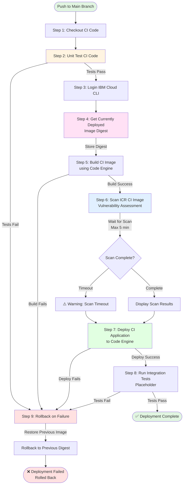

# CI Pipeline Flow Diagram

This diagram illustrates the complete flow of the CI/CD deployment pipeline.

## Pipeline Steps Overview

| Step | Name | Purpose | On Failure |
|------|------|---------|------------|
| 1 | Checkout CI Code | Retrieves latest code from main branch | Fails pipeline |
| 2 | Unit Test CI Code | Runs npm test-unit | Triggers rollback |
| 3 | Login IBM Cloud CLI | Authenticates with IBM Cloud, installs plugins | Triggers rollback |
| 4 | Get Currently Deployed Image Digest | Stores current image digest for rollback | Triggers rollback |
| 5 | Build CI Image | Builds Docker image as ci-{image}:latest | Triggers rollback |
| 6 | Scan ICR CI Image | Performs vulnerability scan (waits up to 5 min) | Continues with warning |
| 7 | Deploy CI Application | Deploys to Code Engine (1 CPU, 4GB memory) | Triggers rollback |
| 8 | Run Integration Tests | Tests deployed application (placeholder) | Triggers rollback |
| 9 | Rollback on Failure | Restores previous image if any step fails | N/A |

## Key Features

- **🚀 Automatic Deployment**: Deploys to production Code Engine environment
- **🔄 Rollback Protection**: Automatically reverts to previous image on failure
- **📦 Persistent Images**: Stores images in ICR with 'latest' tag
- **🔒 Security Scanning**: Vulnerability assessment with IBM Vulnerability Advisor
- **🧪 Integration Testing**: Tests against live deployment (placeholder for implementation)
- **⚡ Fast Deployment**: Leverages Code Engine's serverless platform
- **💾 Digest Tracking**: Stores previous image digest for reliable rollback

## Deployment Configuration

The application is deployed with the following specifications:

- **CPU**: 1 vCPU
- **Memory**: 4GB
- **Registry**: Private IBM Container Registry
- **Image**: `private.{region}/{namespace}/ci-{image-name}:latest`
- **Registry Secret**: Auto-generated Code Engine secret

## Rollback Mechanism

The pipeline implements automatic rollback on failure:

1. **Before Deployment**: Captures the digest of the currently deployed image
2. **On Failure**: If any step fails after the digest capture, the rollback step executes
3. **Rollback Action**: Updates the Code Engine application to use the previous image digest
4. **Result**: Service continues running with the last known good version

## Configuration

The pipeline requires the following GitHub Secrets and Variables:

### Secrets
- `IBMCLOUD_API_KEY` - IBM Cloud API key with appropriate permissions

### Variables
- `IBMCLOUD_REGION` - IBM Cloud region (e.g., us-south)
- `ICR_REGION` - Container Registry region (e.g., us.icr.io)
- `ICR_NAMESPACE` - Container Registry namespace
- `RESOURCE_GROUP` - IBM Cloud resource group
- `PROJECT_NAME` - Code Engine project name
- `APP_NAME` - Code Engine application name
- `IMAGE_NAME` - Base container image name

## Triggers

- Push to `main` branch
- Manual workflow dispatch

## Future Enhancements

- [ ] Complete integration tests implementation
- [ ] Add deployment notifications
- [ ] Implement blue-green deployment
- [ ] Add monitoring and alerting
- [ ] Configure custom domain
- [ ] Add automated rollback testing

## Comparison with PR Pipeline

| Feature | PR Pipeline | CI Pipeline |
|---------|-------------|-------------|
| **Trigger** | PR opened/reopened | Push to main |
| **Purpose** | Validation only | Build & Deploy |
| **Image Tag** | pr-{image}:{sha} | ci-{image}:latest |
| **Deployment** | ❌ No | ✅ Yes |
| **Image Cleanup** | ✅ Yes (temporary) | ❌ No (persistent) |
| **Rollback** | N/A | ✅ Yes |
| **Integration Tests** | ❌ No | ✅ Yes (placeholder) |