# PR Pipeline Flow Diagram

This diagram illustrates the complete flow of the PR validation pipeline.

```mermaid
flowchart TD
    Start([PR Opened/Reopened]) --> Checkout[Step 1: Checkout PR Code]
    
    Checkout --> CheckSize[Step 2: Check PR Size]
    CheckSize -->|Lines > MAX_PR_LINES| Fail1[❌ Fail: PR Too Large]
    CheckSize -->|Lines ≤ MAX_PR_LINES| SetPending[Step 3: Set Commit Status<br/>pending]
    SetPending --> UnitTest[Step 4: Unit Test PR Code]
    
    UnitTest -->|Tests Fail| SetFail[Step 9a: Set Commit Status<br/>failure]
    UnitTest -->|Tests Pass| BuildImage[Step 5: Build PR Image<br/>using Code Engine]
    
    BuildImage -->|Build Fails| SetFail
    BuildImage -->|Build Success| LoginCLI[Step 6: Login IBM Cloud CLI]
    
    LoginCLI --> ScanImage[Step 7: Scan ICR PR Image<br/>Vulnerability Assessment]
    
    ScanImage -->|Wait for Scan<br/>Max 5 min| ScanComplete{Scan Complete?}
    ScanComplete -->|Timeout| ScanWarning[⚠️ Warning: Scan Timeout]
    ScanComplete -->|Complete| DisplayResults[Display Scan Results]
    
    ScanWarning --> RemoveImage[Step 8: Remove ICR PR Image]
    DisplayResults --> RemoveImage
    
    RemoveImage -->|Image Exists| DeleteImage[Delete PR Image]
    RemoveImage -->|Image Not Found| SkipDelete[Skip Deletion]
    
    DeleteImage --> SetSuccess[Step 9b: Set Commit Status<br/>success]
    SkipDelete --> SetSuccess
    
    SetSuccess --> End([✅ PR Validation Complete])
    SetFail --> End2([❌ PR Validation Failed])
    Fail1 --> End2
    
    style Start fill:#e1f5e1
    style End fill:#e1f5e1
    style End2 fill:#ffe1e1
    style Fail1 fill:#ffe1e1
    style SetFail fill:#ffe1e1
    style SetSuccess fill:#e1f5e1
    style CheckSize fill:#fff4e1
    style ScanImage fill:#e1f0ff
    style RemoveImage fill:#f0e1ff
```

## Pipeline Steps Overview

| Step | Name | Purpose | On Failure |
|------|------|---------|------------|
| 1 | Checkout PR Code | Retrieves PR branch code | Fails pipeline |
| 2 | Check PR Size | Validates PR has ≤ MAX_PR_LINES changes (default: 1000) | Fails immediately |
| 3 | Set Commit Status (Pending) | Updates GitHub PR status to "pending" | Fails pipeline |
| 4 | Unit Test PR Code | Runs npm test-unit | Fails pipeline |
| 5 | Build PR Image | Builds Docker image with Code Engine | Fails pipeline |
| 6 | Login IBM Cloud CLI | Authenticates with IBM Cloud | Fails pipeline |
| 7 | Scan ICR PR Image | Performs vulnerability scan (waits up to 5 min) | Continues with warning |
| 8 | Remove ICR PR Image | Cleans up temporary PR image | Continues if not found |
| 9a | Set Commit Status (Failure) | Updates PR status on failure | N/A |
| 9b | Set Commit Status (Success) | Updates PR status on success | N/A |

## Key Features

- **🔍 Validation Only**: Does NOT deploy to Code Engine
- **🧹 Auto Cleanup**: Removes temporary PR images from registry
- **📊 PR Status Updates**: Visible in GitHub PR interface
- **🔒 Security Scanning**: Real vulnerability assessment with IBM Vulnerability Advisor
- **📏 Size Validation**: Configurable PR size limit via MAX_PR_LINES variable
- **⏱️ Scan Timeout**: Waits up to 5 minutes for vulnerability scan completion

## Configuration

The pipeline can be customized via GitHub Variables:

- `MAX_PR_LINES` - Maximum lines allowed in PR (default: 1000)
- `IBMCLOUD_REGION` - IBM Cloud region
- `ICR_REGION` - Container Registry region
- `ICR_NAMESPACE` - Container Registry namespace
- `PROJECT_NAME` - Code Engine project name
- `IMAGE_NAME` - Base container image name

## Triggers

- Pull request opened
- Pull request reopened
- Manual workflow dispatch